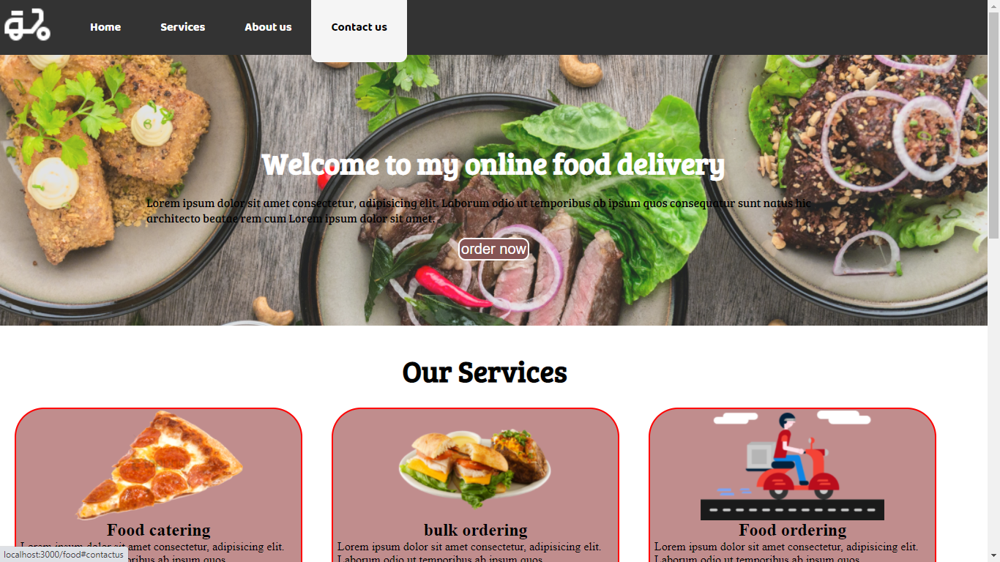
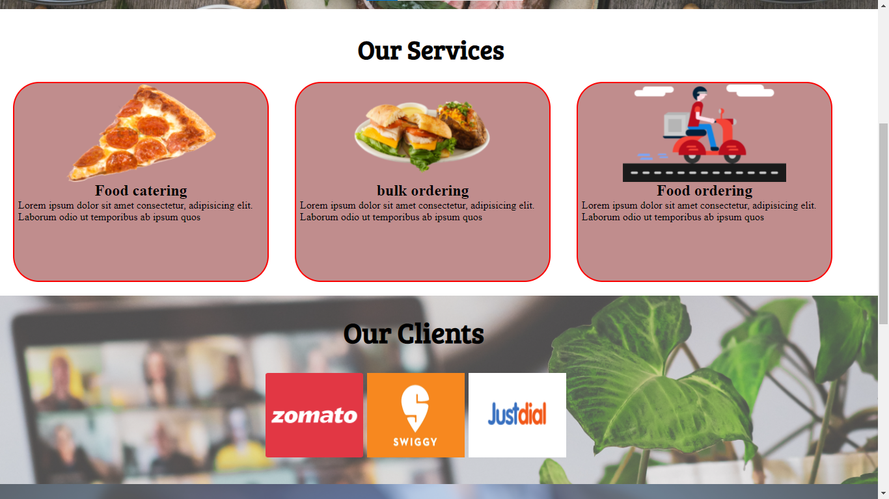
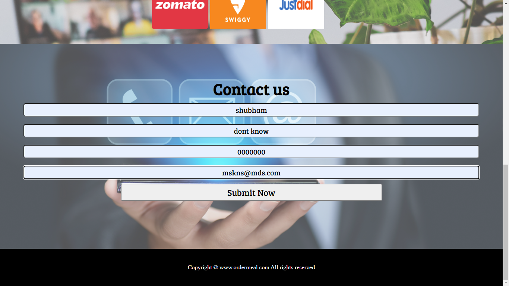
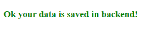
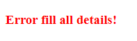
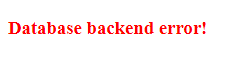

# Food_delivery

This is food delivery website learned from youtube tutorial and i added it backend for contact us form and smooth scrolling as well 

# Screenshots:

## 👋 Hi, To use this (you should know a bit about atleast node js and expressjs):
- git clone
- npm install (for installing node_modeules)
- add DB_CONNECTION=your cluster from mongo db atlas link  ( in .env)
- and then do npm start and go to localhost:3000/food
- also added to view database  by localhost:3000/viewdatabase

